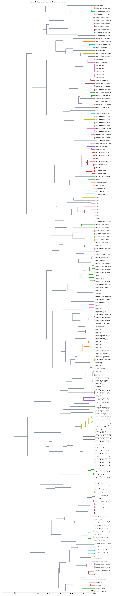
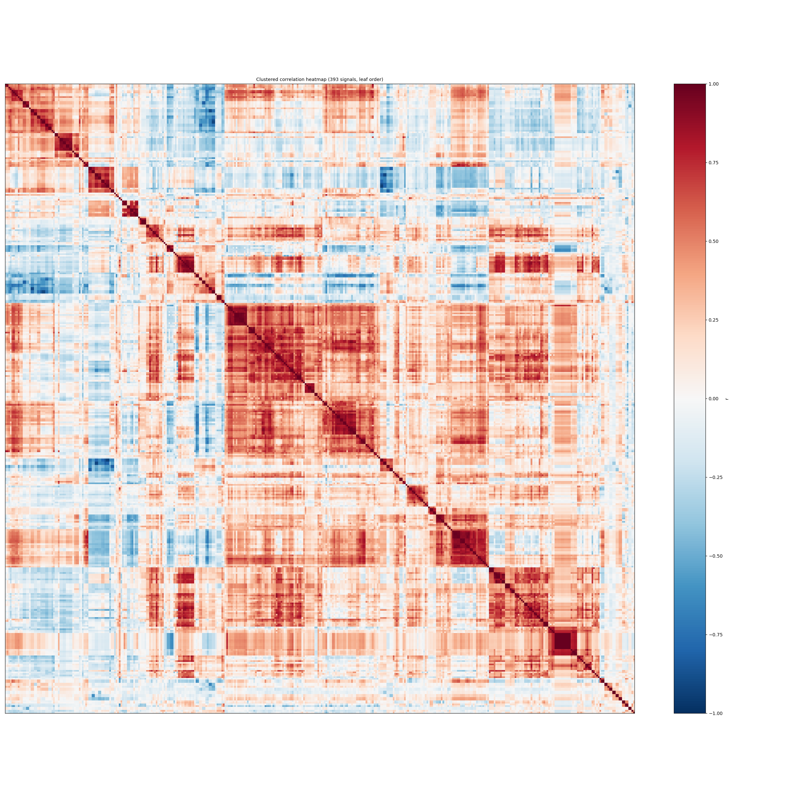

# Analysis — signal groupings & commodity-cycle control

## 1. Hierarchical clustering of the leading signals

Average linkage on `d = 1 − r` (contemporaneous YoY). Cutting the tree at **r = 0.70** (distance 0.30) gives these groups:

**156 signals → 156 independent forces** (91 multi-signal clusters + 65 singletons).

Multi-signal clusters (each = ONE witness):
- **Cluster 1** (15 signals): Industrial production: manufacturing, Capacity utilization: manufacturing, Manufacturing: Durable Goods: Fabricated Met, Manufacturing: Durable Goods: Machinery (NAI, Manufacturing: Durable Goods: Electrical Equ, Manufacturing (NAICS), Durable Goods Materials: Durable Goods Mater, Materials, Manufacturing: Durable Goods: Machinery (NAI, Manufacturing: Durable Goods: Electrical Equ, Capacity Utilization: Manufacturing Excludin, Capacity Utilization: Total Excluding Comput, Industrial Production: Total Index, Industrial Production: Total Index, Industrial Production: Final Products
- **Cluster 2** (14 signals): 10-Year Treasury yield, Market Yield on U.S. Treasury Securities at, Market Yield on U.S. Treasury Securities at, Market Yield on U.S. Treasury Securities at, 10-Year Expected Inflation, 11-Year Expected Inflation, 12-Year Expected Inflation, 13-Year Expected Inflation, 14-Year Expected Inflation, 15-Year Expected Inflation, 16-Year Expected Inflation, 17-Year Expected Inflation, 18-Year Expected Inflation, 19-Year Expected Inflation
- **Cluster 3** (13 signals): Copper PPI, Global copper price, Metals and Metal Products: Nonferrous Metals, Metals and Metal Products: Nonferrous Metal, Metals and Metal Products: Primary Nonferrou, Metals and Metal Products: Nonferrous Scrap, Metals and Metal Products: Secondary Nonferr, Producer Price Index by Commodity: Metals an, Producer Price Index by Commodity: Metals an, Producer Price Index by Commodity: Metals an, Import Price Index (End Use): Major Nonferro, Global price of Metal index, Global price of Industrial Materials index
- **Cluster 4** (12 signals): WTI crude oil, Refined petroleum products PPI, Import: Industrial Supplies & Materials, Brent Crude, WTI Crude, Fuels and Related Products and Power: Crude, Fuels and Related Products and Power: Natura, Import Price Index (End Use): Crude Oil, Import Price Index (End Use): Petroleum Prod, Import Price Index (End Use): All Commoditie, Global price of Energy index, Global Price Index of All Commodities
- **Cluster 5** (10 signals): Electrical machinery & equip. PPI, Metals and Metal Products: Hardware, Metals and Metal Products: Hardware, Not Els, Metals and Metal Products: Hand and Edge Too, Machinery and Equipment, Machinery and Equipment: Construction Machin, Machinery and Equipment: Metalworking Machin, Machinery and Equipment: General Purpose Mac, Machinery and Equipment: Special Industry Ma, Machinery and Equipment: Miscellaneous Machi
- **Cluster 6** (8 signals): Authorized in Permit-Issuing Places: Total U, Authorized in Permit-Issuing Places: Single-, Started: Total Units, Started: Single-Family Units, New Privately-Owned Housing Units Authorized, New Privately-Owned Housing Units Authorized, New Privately-Owned Housing Units Started: S, New Privately-Owned Housing Units Started: T
- **Cluster 7** (8 signals): Nonferrous wire & cable PPI, Import: Ind. Supplies & Materials (ex-fuel), Import: Ind. Supplies & Materials (durable), Metals and Metal Products, Metals and Metal Products: Nonferrous Mill S, Import Price Index (End Use): Finished Metal, Import Price Index (End Use): Unfinished Met, Import Price Index (End Use): Industrial Sup
- **Cluster 8** (7 signals): Electric power PPI, Chemicals and Allied Products: Other Chemica, Fuels and Related Products and Power: Reside, Producer Price Index by Commodity: Fuels and, Producer Price Index by Commodity: Fuels and, Producer Price Index by Industry: Electric P, Producer Price Index by Industry: Electric P
- **Cluster 9** (6 signals): New orders: electrical equipment, New Orders: Machinery, New Orders: Fabricated Metal Products, New Orders: Durable Goods, New Orders: Total Manufacturing, New Orders: Nondefense Capital Goods Excludi
- **Cluster 10** (6 signals): Natural gas PPI, Natural Gas, US Henry Hub Gas, Fuels and Related Products and Power: Gas Fu, Fuels and Related Products and Power: Utilit, Import Price Index (End Use): Fuels, N.e.s., Import Price Index (End Use): Natural Gas
- **Cluster 11** (5 signals): Future General Activity, Future New Orders, Future General Activity; Diffusion Index for, Future General Activity; Percent Reporting I, Future General Activity; Percent Reporting I
- **Cluster 12** (5 signals): Manufacturing employment, Employment: electrical-equip mfg, Primary Metal Manufacturing, Fabricated Metal Product Manufacturing, Machinery Manufacturing
- **Cluster 13** (5 signals): 10-Year Treasury Constant Maturity Minus 3-M, Moody's Seasoned Aaa Corporate Bond Minus Fe, Moody's Seasoned Baa Corporate Bond Minus Fe, 10-Year Treasury Constant Maturity Minus Fed, 5-Year Treasury Constant Maturity Minus Fede
- **Cluster 14** (5 signals): Metals and Metal Products: Metal Containers, Metals and Metal Products: Miscellaneous Met, Metals and Metal Products: Metal Cans and Ca, Machinery and Equipment: Agricultural Machin, Machinery and Equipment: Agricultural Machin
- **Cluster 15** (4 signals): New Orders: Primary Metals, Manufacturing: Durable Goods: Primary Metal, Manufacturing: Durable Goods: Iron and Steel, Manufacturing: Durable Goods: Primary Metal
- **Cluster 16** (4 signals): Current Work Hours; Diffusion Index for Fede, Current Work Hours; Diffusion Index for Fede, Current Work Hours; Percent Reporting Increa, Current Work Hours; Percent Reporting Increa
- **Cluster 17** (4 signals): Current Work Hours; Percent Reporting Decrea, Current Work Hours; Percent Reporting Decrea, Current General Activity; Percent Reporting, Current General Activity; Percent Reporting
- **Cluster 18** (4 signals): Future Work Hours; Diffusion Index for Feder, Future Work Hours; Diffusion Index for Feder, Future Work Hours; Percent Reporting Increas, Future Work Hours; Percent Reporting Increas
- **Cluster 19** (4 signals): Baa Corporate Bond Yield Relative to Yield o, Aaa Corporate Bond Yield Relative to Yield o, Moody's Seasoned Aaa Corporate Bond Yield Re, Moody's Seasoned Baa Corporate Bond Yield Re
- **Cluster 20** (4 signals): Future Capital Expenditures, Future Capital Expenditures; Diffusion Index, Future Capital Expenditures; Percent Reporti, Future Capital Expenditures; Percent Reporti
- **Cluster 21** (4 signals): 10-Year Constant Maturity, Quoted on an Inve, 30-Year Fixed Rate Mortgage Average, Baa Corporate Bond Yield, Aaa Corporate Bond Yield
- **Cluster 22** (4 signals): 2-Year Constant Maturity, Quoted on an Inves, 1-Year Constant Maturity, Quoted on an Inves, 3-Month Treasury Bill Secondary Market Rate,, Market Yield on U.S. Treasury Securities at
- **Cluster 23** (4 signals): Industrial production: utilities, Industrial Production: Utilities: Electric a, Capacity Utilization: Utilities: Electric an, Capacity Utilization: Utilities: Electric Po
- **Cluster 24** (4 signals): Import Price Index (End Use): Nonelectrical, Import Price Index (End Use): Durables, Manu, Import Price Index (End Use): Capital Goods,, Import Price Index (End Use): Consumer Goods
- **Cluster 25** (4 signals): Truck Transportation, Transportation Services: Truck Transportatio, Coal, Australia, Total Manufacturing Industries
- **Cluster 26** (4 signals): Producer Price Index by Industry: Pipeline T, Producer Price Index by Industry: Pipeline T, Producer Price Index by Industry: Pipeline T, Producer Price Index by Industry: Pipeline T
- **Cluster 27** (4 signals): Future Prices Paid, Current Prices Paid, Current Prices Received, Current Prices Paid
- **Cluster 28** (4 signals): Current Unfilled Orders, Current Unfilled Orders; Diffusion Index for, Current Unfilled Orders; Percent Reporting I, Current Unfilled Orders; Percent Reporting I
- **Cluster 29** (4 signals): Future Unfilled Orders; Diffusion Index for, Future Unfilled Orders; Diffusion Index for, Future Unfilled Orders; Percent Reporting In, Future Unfilled Orders; Percent Reporting In
- **Cluster 30** (4 signals): Future Unfilled Orders; Percent Reporting De, Future Unfilled Orders; Percent Reporting De, Future General Activity; Percent Reporting D, Future General Activity; Percent Reporting D
- **Cluster 31** (4 signals): Chemicals and Allied Products, Import Price Index (End Use): Iron and Steel, Import Price Index (End Use): Iron and Steel, Import Price Index (End Use): Agricultural P
- **Cluster 32** (4 signals): Plastic products PPI, Rubber and Plastic Products, Rubber and Plastic Products: Plastic Constru, Rubber and Plastic Products: Unsupported Pla
- **Cluster 33** (4 signals): Iron & steel PPI, Cold-rolled steel sheet (GOES proxy), Steel mill products PPI, Producer Price Index by Commodity: Metals an
- **Cluster 34** (4 signals): Metals and Metal Products: Foundry and Forge, Producer Price Index by Commodity: Metals an, Producer Price Index by Commodity: Metals an, Producer Price Index by Commodity: Metals an
- **Cluster 35** (4 signals): Metals and Metal Products: Heating Equipment, Chemicals and Allied Products: Paints and Al, Chemicals and Allied Products: Prepared Pain, Machinery and Equipment: Miscellaneous Const
- **Cluster 36** (4 signals): Metals and Metal Products: Fabricated Struct, Metals and Metal Products: Barrels, Drums, P, Producer Price Index by Commodity: Metals an, Producer Price Index by Commodity: Metals an
- **Cluster 37** (3 signals): Current General Activity, Current New Orders, Current General Activity; Diffusion Index fo
- **Cluster 38** (3 signals): Industrial Production: Consumer Goods, Industrial Production: Durable Consumer Good, Industrial Production: Durable Consumer Good
- **Cluster 39** (3 signals): Producer Price Index by Industry: Scheduled, Producer Price Index by Industry: Scheduled, Producer Price Index by Industry: Scheduled
- **Cluster 40** (3 signals): Producer Price Index by Industry: Deep Sea F, Producer Price Index by Industry: Deep Sea F, Producer Price Index by Industry: Deep Sea F
- **Cluster 41** (3 signals): Producer Price Index by Industry: Refined Pe, Producer Price Index by Industry: Refined Pe, Producer Price Index by Industry: Refined Pe
- **Cluster 42** (3 signals): New Privately-Owned Housing Units Authorized, New Privately-Owned Housing Units Started: U, New Privately-Owned Housing Units Authorized
- **Cluster 43** (3 signals): 1-Year Treasury Constant Maturity Minus Fede, 3-Month Treasury Bill Minus Federal Funds Ra, 6-Month Treasury Bill Minus Federal Funds Ra
- **Cluster 44** (3 signals): Fuels and Related Products and Power: Coal, Fuels and Related Products and Power: Bitumi, Fuels and Related Products and Power: Coal
- **Cluster 45** (3 signals): Chemicals and Allied Products: Industrial Ch, Chemicals and Allied Products: Plastic Resin, Chemicals and Allied Products: Basic Organic
- **Cluster 46** (3 signals): Rubber and Plastic Products: Rubber and Rubb, Rubber and Plastic Products: Tires, Tubes, T, Rubber and Plastic Products: Miscellaneous R
- **Cluster 47** (3 signals): Metals and Metal Products: Plumbing Fixtures, Producer Price Index by Commodity: Metals an, Producer Price Index by Commodity: Metals an
- **Cluster 48** (2 signals): Manufacturers' Unfilled Orders: Iron and Ste, Manufacturers' Unfilled Orders: Primary Meta
- **Cluster 49** (2 signals): Unfilled Orders: Electrical Equipment, Appli, Manufacturers' Unfilled Orders: Fabricated M
- **Cluster 50** (2 signals): Current Work Hours; Percent Reporting No Cha, Current Work Hours; Percent Reporting No Cha
- **Cluster 51** (2 signals): Future Work Hours; Percent Reporting Decreas, Future Work Hours; Percent Reporting Decreas
- **Cluster 52** (2 signals): Future Work Hours; Percent Reporting No Chan, Future Work Hours; Percent Reporting No Chan
- **Cluster 53** (2 signals): Industrial Capacity: Utilities: Electric and, Industrial Capacity: Utilities: Electric Pow
- **Cluster 54** (2 signals): Industrial Capacity: Manufacturing Excluding, Industrial Capacity: Total Excluding Compute
- **Cluster 55** (2 signals): Future Capital Expenditures, Current Employment
- **Cluster 56** (2 signals): Future Capital Expenditures; Percent Reporti, Future Capital Expenditures; Percent Reporti
- **Cluster 57** (2 signals): Future Capital Expenditures; Percent Reporti, Future Capital Expenditures; Percent Reporti
- **Cluster 58** (2 signals): Nominal Broad U.S. Dollar Index, Nominal Advanced Foreign Economies U.S. Doll
- **Cluster 59** (2 signals): Current General Business Conditions, Current New Orders
- **Cluster 60** (2 signals): Future General Activity; Percent Reporting N, Future General Activity; Percent Reporting N
- **Cluster 61** (2 signals): Industrial Production: Durable Consumer Good, Industrial Production: Durable Consumer Good
- **Cluster 62** (2 signals): Industrial Production: Durable Goods Materia, Industrial Production: Durable Goods Materia
- **Cluster 63** (2 signals): Mining: Mining (NAICS = 21), Energy, Total
- **Cluster 64** (2 signals): Import Price Index (End Use): Foods, Feeds,, Import Price Index (End Use): Green Coffee,
- **Cluster 65** (2 signals): Import Price Index (End Use): Metal Working, Import Price Index (End Use): Automotive Par
- **Cluster 66** (2 signals): Import Price Index (End Use): Automotive Veh, Import Price Index (End Use): Passenger Cars
- **Cluster 67** (2 signals): Import Price Index (End Use): Apparel, House, Import Price Index (End Use): Apparel, Texti
- **Cluster 68** (2 signals): Total Business: Inventories to Sales Ratio, Manufacturers: Inventories to Sales Ratio
- **Cluster 69** (2 signals): Future Employment; Diffusion Index for Feder, Future Employment; Diffusion Index for Feder
- **Cluster 70** (2 signals): Future Employment; Percent Reporting Decreas, Future Employment; Percent Reporting Decreas
- **Cluster 71** (2 signals): Global aluminum price, Producer Price Index by Commodity: Metals an
- **Cluster 72** (2 signals): Producer Price Index by Industry: Scheduled, Producer Price Index by Industry: Scheduled
- **Cluster 73** (2 signals): New Privately-Owned Housing Units Authorized, New Privately-Owned Housing Units Authorized
- **Cluster 74** (2 signals): Future Prices Paid, Future Prices Received
- **Cluster 75** (2 signals): Rubber, Global price of Agr. Raw Material Index
- **Cluster 76** (2 signals): Global zinc price, Import: Zinc
- **Cluster 77** (2 signals): 10-Year Treasury Constant Maturity Minus 2-Y, 10-Year Treasury Constant Maturity Minus 2-Y
- **Cluster 78** (2 signals): 10-Year Breakeven Inflation Rate, 5-Year, 5-Year Forward Inflation Expectation
- **Cluster 79** (2 signals): Manufacturing, Nonresidential
- **Cluster 80** (2 signals): Total Construction, Construction
- **Cluster 81** (2 signals): Current Unfilled Orders; Percent Reporting D, Current Unfilled Orders; Percent Reporting D
- **Cluster 82** (2 signals): Current Unfilled Orders; Percent Reporting N, Current Unfilled Orders; Percent Reporting N
- **Cluster 83** (2 signals): Future Unfilled Orders; Percent Reporting No, Future Unfilled Orders; Percent Reporting No
- **Cluster 84** (2 signals): Fuels and Related Products and Power: Anthra, Machinery and Equipment: Parts for Construct
- **Cluster 85** (2 signals): Chemicals and Allied Products: Fats and Oils, Global price of Food index
- **Cluster 86** (2 signals): Chemicals and Allied Products: Agricultural, Chemicals and Allied Products: Basic Inorgan
- **Cluster 87** (2 signals): Iron & steel scrap PPI, Producer Price Index by Commodity: Metals an
- **Cluster 88** (2 signals): Producer Price Index by Commodity: Metals an, Producer Price Index by Commodity: Metals an
- **Cluster 89** (2 signals): Metals and Metal Products: Nonferrous Foundr, Producer Price Index by Commodity: Metals an
- **Cluster 90** (2 signals): Machinery and Equipment: Tractors and Attach, Machinery and Equipment: Off-Highway, Equipm
- **Cluster 91** (2 signals): Machinery and Equipment: Power Cranes, Dragl, Machinery and Equipment: Mixers, Pavers, and
- …plus 65 singletons (each its own independent force).

*How to read it:* signals that merge **below** the red line are ≥0.70 correlated — the same underlying price force. Count each such cluster as ONE independent witness, not as many. Average linkage (not single linkage) is used so a loose pair can't be chained together through a bridging third signal.

## 2. Does each confirmed signal survive the broad commodity cycle?

Market control = **All-commodities PPI (market control)** (`PPIACO`). For each confirmed signal, at its measured lead: **raw** lead-r and the **partial** r holding the market constant. Survival is decided on the **partial r alone** — the correct measure of predictive power beyond the cycle. `retained` = partial / raw.

| Signal | Lead | β (signal) | Raw r | Partial r (∣mkt) | Retained | Survival | Mechanism |
|--------|------|-----------|-------|------------------|----------|----------|-----------|
| Cold-rolled steel sheet (GOES proxy) | +6 | 3.4 | +0.71 | +0.53 | 74% | **survives** | Grain-oriented electrical steel — the transformer CORE material — is a… |
| Producer Price Index by Commodity: Metals an | +6 | 1.8 | +0.78 | +0.53 | 68% | **survives** | Upstream input material/energy cost (metals, energy, materials) that f… |
| Producer Price Index by Commodity: Metals an | +9 | 2.2 | +0.65 | +0.50 | 77% | **survives** | Upstream input material/energy cost (metals, energy, materials) that f… |
| Metals and Metal Products | +5 | 1.2 | +0.78 | +0.49 | 63% | **survives** | Producer price for a metals/metal-products group — a material-input si… |
| Rubber and Plastic Products: Plastic Constru | +3 | 0.8 | +0.70 | +0.47 | 67% | **survives** | Producer price for a plastics/rubber-products group — insulation/enclo… |
| Nonferrous wire & cable PPI | +6 | 1.2 | +0.68 | +0.44 | 66% | **survives** | The literal wound-conductor product (copper/aluminum wire & cable) tha… |
| Steel mill products PPI | +4 | 2.0 | +0.66 | +0.36 | 54% | **survives** | Broad finished steel (sheet, plate, structural) fabricated into transf… |
| Metals and Metal Products: Nonferrous Mill S | +6 | 1.2 | +0.65 | +0.35 | 54% | **survives** | Producer price for a metals/metal-products group — a material-input si… |
| Producer Price Index by Commodity: Metals an | +7 | 1.3 | +0.61 | +0.34 | 56% | **survives** | Upstream input material/energy cost (metals, energy, materials) that f… |
| Global price of Metal index | +7 | 1.9 | +0.52 | +0.34 | 66% | **survives** | Global commodity benchmark / trade-weighted dollar; traded-input trian… |
| Global tin price | +6 | 3.1 | +0.59 | +0.34 | 58% | **survives** | Tin is the solder that joins electrical connections in transformers, s… |
| Copper PPI | +8 | 1.6 | +0.53 | +0.34 | 64% | **survives** | Copper is the primary conductor for transformer windings; its input pr… |
| Global copper price | +7 | 2.4 | +0.53 | +0.34 | 64% | **survives** | Independent global (LME-based) copper benchmark; triangulates the dome… |
| Metals and Metal Products: Nonferrous Metals | +7 | 1.4 | +0.60 | +0.33 | 55% | **survives** | Producer price for a metals/metal-products group — a material-input si… |
| Global price of Industrial Materials index | +7 | 1.8 | +0.53 | +0.32 | 61% | **survives** | Global commodity benchmark / trade-weighted dollar; traded-input trian… |
| Iron & steel PPI | +4 | 1.9 | +0.67 | +0.32 | 47% | **survives** | Electrical (silicon) steel forms the transformer core; broad iron & st… |
| Metals and Metal Products: Secondary Nonferr | +8 | 1.4 | +0.54 | +0.31 | 57% | **survives** | Producer price for a metals/metal-products group — a material-input si… |
| Producer Price Index by Commodity: Metals an | +7 | 1.6 | +0.54 | +0.29 | 55% | **partly survives** | Upstream input material/energy cost (metals, energy, materials) that f… |
| Import Price Index (End Use): Finished Metal | +3 | 0.9 | +0.71 | +0.29 | 41% | **partly survives** | Imported input cost (metals, capital goods, industrial supplies); deli… |
| Metals and Metal Products: Primary Nonferrou | +7 | 1.7 | +0.54 | +0.28 | 52% | **partly survives** | Producer price for a metals/metal-products group — a material-input si… |
| Aluminum mill shapes PPI | +4 | 1.2 | +0.61 | +0.26 | 43% | **partly survives** | Aluminum is the main alternative winding conductor and is used in hous… |
| Import Price Index (End Use): Major Nonferro | +6 | 1.7 | +0.52 | +0.25 | 49% | **partly survives** | Imported input cost (metals, capital goods, industrial supplies); deli… |
| Global aluminum price | +5 | 2.2 | +0.56 | +0.24 | 43% | **partly survives** | Independent global aluminum benchmark; triangulates the domestic alumi… |
| Import Price Index (End Use): Iron and Steel | +4 | 1.4 | +0.64 | +0.22 | 34% | **partly survives** | Imported input cost (metals, capital goods, industrial supplies); deli… |
| Import: Ind. Supplies & Materials (durable) | +5 | 1.2 | +0.63 | +0.21 | 33% | **partly survives** | Import price index; imported input costs tend to lead domestic PPI.… |
| Chemicals and Allied Products: Plastic Resin | +4 | 1.7 | +0.60 | +0.20 | 34% | **partly survives** | Producer price for a chemicals group (resins, coatings, treatment chem… |

*How to read it:* **raw r** is the headline lead correlation. **Partial r** removes the part of the co-movement that is really just the whole commodity complex rising and falling together; what's left is the signal's own, transformer-specific information — and that is what the **survival** verdict is based on. If the partial r stays strong (**survives**), the signal is genuinely informative beyond the cycle; if it collapses toward zero (**cycle-driven**), the signal was mostly riding the general boom/bust and adds little unique lead.

> The naive **relative** (signal − market) series is reported in `cycle_control.csv` as a diagnostic only, **not** used for the verdict. It assumes the signal moves 1-for-1 with the market, so for a high-volatility signal like WTI crude (≈7× the index's volatility) subtracting the index barely changes it — the relative series is ~0.99 correlated with raw crude, so its ‘0.54’ just re-measures crude and overstates survival. The partial correlation weights the market correctly and is the measure to trust (crude: raw 0.59 → partial 0.15 → cycle-driven).

### 2b. The observable de-cycled spread (and why we de-cycle transformers too)

`beta` = how many %-points a series moves per 1 %-point of the market. Subtracting `beta × market` removes a series' cycle exposure *correctly*, whatever its volatility (unlike the naive 1-for-1 relative series). We build two observable, plottable spreads:

- **signal spread** = signal_YoY − β_signal × market_YoY

- **transformer spread** = transformer_YoY − β_transformer × market_YoY

**Should we de-cycle the transformer too? Yes** — transformer prices themselves ride the commodity cycle (they correlate ~0.71 with the broad index), so a fair test removes the cycle from *both* sides. And here is the key identity: **the correlation of the two de-cycled spreads equals the partial correlation exactly.** That is what a partial correlation *is* — the correlation of both variables after the common factor is regressed out of each. So `spread_r_both_decycled` == `partial_r` in the CSV (a numeric check, not a coincidence). De-cycling only the signal (leaving the transformer raw) gives the smaller *semi-partial* correlation and understates the true relationship.

*Why it matters:* the partial r is one number you can't watch month to month; the de-cycled **spread is a real series** you can chart, alert on, or trade — e.g. a live ‘steel-cost excess over the commodity complex’ indicator — while carrying the same, correct, cycle-stripped information as the partial correlation.

### 2c. Per-force test (full battery per cluster, not per signal)

A cluster of ≥0.70-correlated signals is **one witness**, so testing every member separately over-counts the evidence (pseudo-replication). Each multi-signal force is collapsed into an **equal-weighted composite YoY index** and given its OWN peak-lead search, both robustness gates, market-control partial r, permutation p, bootstrap CI and a **verdict** — with Benjamini-Hochberg FDR across the force family. Singletons carry their per-signal verdict.

**Production clustering: `complete` linkage** — every cluster is **tight by construction** (every pair ≥0.70), so no loose grab-bag forms and the split machinery (§2d) is a no-op fallback. **Short-sample signals (overlap < 150 months) are excluded from force formation** so one short member cannot truncate a whole composite's decades-long window.

**78 tight force(s) scored.

| Force | Tier | # | Lead | Raw r | Partial r (∣mkt) | Survival | Verdict |
|-------|------|---|------|-------|------------------|----------|---------|
| **Steel complex** | TIGHT | 4 | +7 | +0.86 | +0.69 | survives | **CONFIRMED** |
| **Manufacturers' Unfilled Orders: Photographic** | TIGHT | 1 | +22 | +0.64 | +0.64 | survives | **STRONG / NOT ROBUST** |
| **Machinery and Equipment: Miscellaneous Instr** | TIGHT | 1 | -10 | +0.60 | +0.60 | survives | **REVERSED** |
| **Current Delivery Time** | TIGHT | 1 | -10 | -0.55 | -0.60 | survives | **REVERSED** |
| **Producer Price Index by Commodity: Metals an** | TIGHT | 1 | -3 | +0.62 | +0.55 | survives | **REVERSED** |
| **Retailers: Inventories to Sales Ratio** | TIGHT | 1 | +12 | -0.55 | -0.54 | survives | **STRONG / NOT ROBUST** |
| **Federal Funds Effective Rate** | TIGHT | 1 | -7 | +0.53 | +0.52 | survives | **REVERSED** |
| **Plastics & materials complex** | TIGHT | 4 | +2 | +0.78 | +0.52 | survives | **CO-MOVER (not a lead)** |
| **Steel complex** | TIGHT | 2 | +9 | +0.66 | +0.50 | survives | **CONFIRMED** |
| **Residential** | TIGHT | 1 | -14 | -0.49 | -0.49 | survives | **REJECTED** |
| **Metals and Metal Products: Nonferrous Forge** | TIGHT | 1 | -2 | +0.52 | +0.47 | survives | **CO-MOVER (not a lead)** |
| **Import Price Index (End Use): Lumber and Oth** | TIGHT | 1 | +14 | +0.49 | +0.45 | survives | **REJECTED** |
| **Rubber and Plastic Products: Laminated Plast** | TIGHT | 1 | +0 | +0.61 | +0.42 | survives | **CO-MOVER (not a lead)** |
| **Future New Orders** | TIGHT | 1 | -6 | -0.43 | -0.42 | survives | **REJECTED** |
| **Oil and Gas Extraction** | TIGHT | 1 | -7 | +0.47 | +0.41 | survives | **REJECTED** |
| **Construction spending: power** | TIGHT | 1 | -12 | +0.41 | +0.39 | survives | **REJECTED** |
| **Current Delivery Time** | TIGHT | 1 | -6 | -0.37 | -0.38 | survives | **REJECTED** |
| **Industrial Capacity: Utilities: Natural Gas** | TIGHT | 1 | -23 | -0.32 | -0.37 | survives | **REJECTED** |
| **Iron Ore** | TIGHT | 1 | +14 | +0.40 | +0.36 | survives | **REJECTED** |
| **Iron ores PPI** | TIGHT | 1 | +0 | +0.59 | +0.36 | survives | **CO-MOVER (not a lead)** |
| **Manufacturers' Unfilled Orders: Ventilation,** | TIGHT | 1 | +3 | +0.55 | +0.34 | survives | **CO-MOVER (not a lead)** |
| **Global tin price** | TIGHT | 1 | +6 | +0.59 | +0.34 | survives | **CONFIRMED** |
| **Machinery and Equipment: Electronic Computer** | TIGHT | 1 | -1 | +0.42 | +0.33 | survives | **CO-MOVER (not a lead)** |
| **Total Public Construction Spending: Power** | TIGHT | 1 | -13 | +0.52 | +0.32 | survives | **REVERSED** |
| **Metals complex** | TIGHT | 13 | +6 | +0.58 | +0.32 | survives | **CONFIRMED** |
| **Producer Price Index by Industry: Carbon and** | TIGHT | 1 | -6 | +0.36 | +0.32 | survives | **REJECTED** |
| **Finished lubricants PPI** | TIGHT | 1 | -3 | +0.53 | +0.31 | survives | **REVERSED** |
| **Import Price Index (End Use): Vegetables** | TIGHT | 1 | -9 | +0.31 | +0.31 | survives | **REJECTED** |
| **Import Price Index (End Use): Toys, Games, a** | TIGHT | 1 | -5 | +0.36 | +0.30 | survives | **REJECTED** |
| **Uranium** | TIGHT | 1 | -3 | +0.34 | +0.29 | partly survives | **REJECTED** |
| **Non-ferrous metals complex** | TIGHT | 8 | +4 | +0.73 | +0.29 | partly survives | **CONFIRMED** |
| **Chemicals and Allied Products: Drugs and Pha** | TIGHT | 1 | -3 | +0.28 | +0.29 | partly survives | **REJECTED** |
| **Producer Price Index by Commodity for Metals** | TIGHT | 1 | +0 | +0.54 | +0.28 | partly survives | **CO-MOVER (not a lead)** |
| **Unfilled Orders: Total Manufacturing** | TIGHT | 1 | -1 | +0.49 | +0.27 | partly survives | **CO-MOVER (not a lead)** |
| **Non-ferrous metals complex** | TIGHT | 2 | +5 | +0.58 | +0.27 | partly survives | **CONFIRMED** |
| **Aluminum mill shapes PPI** | TIGHT | 1 | +4 | +0.61 | +0.26 | partly survives | **CONFIRMED** |
| **Producer Price Index by Industry: Scheduled** | TIGHT | 1 | +9 | -0.18 | -0.24 | partly survives | **REJECTED** |
| **Global nickel price** | TIGHT | 1 | +2 | +0.41 | +0.23 | partly survives | **CO-MOVER (not a lead)** |
| **Industrial Capacity: Manufacturing: Durable** | TIGHT | 1 | +20 | -0.23 | -0.23 | partly survives | **REJECTED** |
| **Import Price Index (End Use): Other Precious** | TIGHT | 1 | +11 | +0.34 | +0.22 | partly survives | **REJECTED** |
| **Global lead price** | TIGHT | 1 | +6 | +0.35 | +0.22 | partly survives | **REJECTED** |
| **Current General Activity; Percent Reporting** | TIGHT | 1 | -17 | +0.21 | +0.21 | partly survives | **REJECTED** |
| **Chemicals and Allied Products: Paint Materia** | TIGHT | 1 | +0 | +0.54 | +0.21 | partly survives | **STRONG / NOT ROBUST** |
| **Current General Activity; Percent Reporting** | TIGHT | 1 | -16 | +0.20 | +0.20 | partly survives | **REJECTED** |
| **Manufacturers' Unfilled Orders: Industrial M** | TIGHT | 1 | -4 | +0.36 | +0.19 | cycle-driven | **REJECTED** |
| **Manufacturers' Unfilled Orders: Mining, Oil,** | TIGHT | 1 | +2 | +0.31 | +0.18 | not cycle-driven (weak on its own) | **REJECTED** |
| **Current General Activity; Percent Reporting** | TIGHT | 1 | +7 | +0.20 | +0.18 | not cycle-driven (weak on its own) | **REJECTED** |
| **Capacity Utilization: Manufacturing: Durable** | TIGHT | 1 | +11 | +0.32 | +0.18 | not cycle-driven (weak on its own) | **REJECTED** |
| **Metals and Metal Products: Vitreous China Pl** | TIGHT | 1 | +0 | +0.39 | +0.18 | cycle-driven | **REJECTED** |
| **New Privately-Owned Housing Units Started: U** | TIGHT | 1 | +3 | -0.23 | -0.17 | not cycle-driven (weak on its own) | **REJECTED** |
| **5-Year Breakeven Inflation Rate** | TIGHT | 1 | +6 | +0.47 | +0.17 | cycle-driven | **REJECTED** |
| **Import Price Index (End Use): Furniture, Hou** | TIGHT | 1 | +0 | +0.42 | +0.17 | cycle-driven | **REJECTED** |
| **Manufacturers' Unfilled Orders: Construction** | TIGHT | 1 | +2 | +0.53 | +0.16 | cycle-driven | **STRONG / NOT ROBUST** |
| **Steel wire PPI** | TIGHT | 1 | +2 | +0.48 | +0.16 | cycle-driven | **CO-MOVER (not a lead)** |
| **Orders/demand complex** | TIGHT | 2 | +3 | +0.58 | +0.16 | cycle-driven | **STRONG BUT CYCLE-DRIVEN** |
| **Import Price Index (End Use): Paper and Pape** | TIGHT | 1 | -1 | +0.41 | +0.14 | cycle-driven | **REJECTED** |
| **Capacity Utilization: Utilities: Natural Gas** | TIGHT | 1 | +22 | -0.13 | -0.14 | not cycle-driven (weak on its own) | **REJECTED** |
| **Producer Price Index by Industry: Couriers a** | TIGHT | 1 | +0 | +0.62 | +0.14 | cycle-driven | **CO-MOVER (not a lead)** |
| **New Orders: Nondefense Capital Goods** | TIGHT | 1 | +7 | +0.37 | +0.13 | cycle-driven | **REJECTED** |
| **Energy & import prices complex** | TIGHT | 12 | +3 | +0.59 | -0.12 | cycle-driven | **STRONG BUT CYCLE-DRIVEN** |
| **Import Price Index (End Use): Meat Products** | TIGHT | 1 | +2 | +0.30 | -0.12 | cycle-driven | **REJECTED** |
| **Producer Price Index by Industry: Pipeline T** | TIGHT | 1 | +21 | +0.12 | +0.12 | not cycle-driven (weak on its own) | **REJECTED** |
| **Rubber and Plastic Products: Synthetic Rubbe** | TIGHT | 1 | +2 | +0.48 | -0.10 | cycle-driven | **CO-MOVER (not a lead)** |
| **Producer Price Index by Commodity: Metals an** | TIGHT | 1 | +0 | +0.17 | +0.09 | not cycle-driven (weak on its own) | **REJECTED** |
| **Fuels and Related Products and Power: Asphal** | TIGHT | 1 | +0 | +0.51 | +0.09 | cycle-driven | **CO-MOVER (not a lead)** |
| **Consumer Sentiment** | TIGHT | 1 | +1 | -0.28 | -0.09 | cycle-driven | **REJECTED** |
| **Orders/demand complex** | TIGHT | 6 | +3 | +0.48 | -0.08 | cycle-driven | **PARTIAL / INCONCLUSIVE** |
| **Import Price Index (End Use): Nondurables, M** | TIGHT | 1 | -24 | +0.18 | +0.08 | not cycle-driven (weak on its own) | **REJECTED** |
| **Import prices complex** | TIGHT | 4 | +2 | +0.70 | +0.08 | cycle-driven | **CO-MOVER (not a lead)** |
| **Import Price Index (End Use): Fish and Shell** | TIGHT | 1 | +4 | +0.45 | +0.08 | cycle-driven | **REJECTED** |
| **Chemicals complex** | TIGHT | 2 | +5 | +0.51 | +0.06 | cycle-driven | **STRONG BUT CYCLE-DRIVEN** |
| **Industrial activity complex** | TIGHT | 4 | +4 | +0.44 | -0.06 | cycle-driven | **PARTIAL / INCONCLUSIVE** |
| **Manufacturers' Unfilled Orders: Ferrous Meta** | TIGHT | 1 | +2 | +0.29 | -0.04 | cycle-driven | **REJECTED** |
| **New Orders: Computers and Electronic Product** | TIGHT | 1 | +3 | +0.23 | +0.04 | cycle-driven | **REJECTED** |
| **Chemicals complex** | TIGHT | 3 | +3 | +0.62 | +0.03 | cycle-driven | **CO-MOVER (not a lead)** |
| **Inflation Expectation** | TIGHT | 1 | +5 | +0.29 | -0.03 | cycle-driven | **REJECTED** |
| **Import Price Index (End Use): Fruits and Fro** | TIGHT | 1 | +2 | +0.30 | +0.02 | cycle-driven | **REJECTED** |
| **1-Year Expected Inflation** | TIGHT | 1 | +2 | +0.44 | -0.01 | cycle-driven | **REJECTED** |

*How to read it:* every row is a **tight** force or a singleton. The **Verdict** is the composite's own CONFIRMED / co-mover / partial / reversed / rejected call; **Survival** is whether its partial r beats the broad commodity cycle. A force that is CONFIRMED *and* survives is a genuine, transformer-specific, independent lead. §2e then checks whether the (now more numerous, smaller) forces are really independent or merely cousins.

### 2e. Force count is NOT a count of independent bets — the cousin check

With `FORCES_MUST_BE_TIGHT`, every leaderboard force is a **tight cluster** (all members ≥0.70 with each other) or a singleton. But tighter clustering makes **more, smaller** forces that can still be **cousins** — correlate 0.5-0.7 with each other (just under the cut). So the force *count* overstates independence. The real independence checks are (a) this **inter-force correlation matrix** (`force_correlation_matrix.csv`), and (b) the **partial-r market control**, which strips the shared commodity cycle — the main reason cousins co-move.

**15 leaderboard forces; 55 cousin pair(s) at 0.50 ≤ |r| < 0.70.**

| Force A | Force B | r |
|---------|---------|---|
| Industrial activity complex | Chemicals complex | +0.70 |
| Plastics & materials complex | Aluminum mill shapes PPI | +0.70 |
| Metals complex | Industrial activity complex | +0.70 |
| Import prices complex | Chemicals complex (2) | +0.70 |
| Metals complex | Aluminum mill shapes PPI | +0.69 |
| Import prices complex | Orders/demand complex (2) | +0.68 |
| Energy & import prices complex | Import prices complex | +0.68 |
| Steel complex | Steel complex (2) | +0.68 |
| Metals complex | Orders/demand complex | +0.67 |
| Orders/demand complex | Non-ferrous metals complex (2) | +0.67 |
| Chemicals complex | Chemicals complex (2) | +0.67 |
| Orders/demand complex | Chemicals complex | +0.67 |

*How to read it:* treat clusters of cousins as **one bet, not several**. E.g. a copper core and a steel core may each be a tight force yet still be cousins through the metals cycle; the partial-r control is what tells you whether each adds transformer-specific information beyond that shared cycle.

## 3. Minimum-history guardrail (short-sample / window-artifact)

Signals whose usable overlap with the outcome is short (**n < 150 months** or a sample starting after **2010-01-01**) can post a huge lead-correlation that is really just the 2020-22 commodity supercycle filling their whole sample. Such a signal is **excluded from CONFIRMED** unless a long, independent series measuring the same force (a pre-2010 confirmed co-member of its ≥0.70 cluster) corroborates it — **and** it is not a window artifact.

**Window-artifact check.** For each short signal we re-measure a long benchmark (**Copper PPI (1967-start benchmark)**) *restricted to the short signal's own window*. If that generic long metal already scores about the same correlation over the window, the signal's edge is the window, not the signal. `bench full` is the same benchmark over its entire 1967-start history; `inflation` = window − full shows how much that particular window puffs up any metal.

**2 short-sample signal(s); 2 downgraded out of CONFIRMED.**

| Signal | n | Start | Lead | Signal r | Bench r (same window) | Bench r (full) | Inflation | Artifact? | Long corroborator | Verdict |
|--------|---|-------|------|----------|-----------------------|----------------|-----------|-----------|-------------------|---------|
| Import: Copper | 80 | 2018-12-01 | +10 | 0.857 | 0.8804 | 0.5257 | 0.3547 | **yes** | Copper PPI; Global copper price; Import Price Index (End Use): Major Nonferro; Global price of Metal index; Global price of Industrial Materials index | **SHORT-SAMPLE (unverified)** |
| Transportation Services: Truck Transportatio | 190 | 2010-06-01 | +2 | 0.8143 | 0.6962 | 0.5257 | 0.1705 | **no** | (none) | **SHORT-SAMPLE (unverified)** |

*How to read it:* if **Signal r ≈ Bench r (same window)** and the benchmark's window value is far above its full-history value (**Inflation** large and positive), the short signal has demonstrated nothing a generic long metal doesn't already show over the same months — its lead is a **window artifact**. The underlying force may still be real (that is what the long corroborator establishes), but *this particular short series* is not independent evidence of it and is not counted as a CONFIRMED lead.
